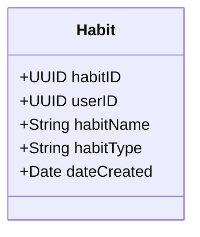

# Habit Tracker

A habit tracker made for coders who want to automatically track their habits over time (without opening an app everytime). The coder can call an endpoint by whatever means necessary for specific habit tracking. For example, if I call the endpoint everytime I connect to gym wifi, then the app will know that I went to the gym today.

## Why?

Your life is the result of your habits. I have trouble staying disiplined, and none of the apps I've tried have worked (or they're too expensive). This app is specifically for me, but could be useful for others when I finish.

## Database

